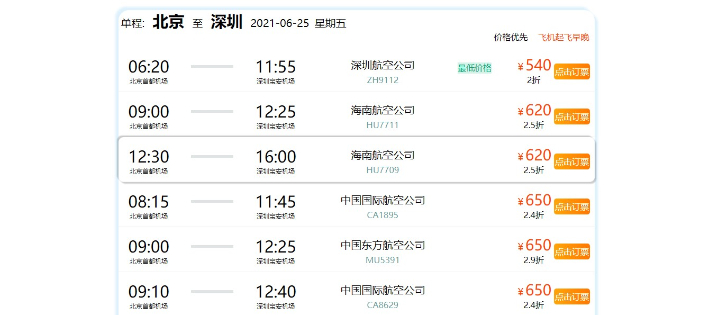

## 项目简介
&emsp;&emsp;本次项目为毕业设计作品，毕业课题为《Python数据分析在机票预订系统中的应用研究》。机票预订系统是课题研究的应用载体，采用B/S架构建站，同时遵循前后端分离原则。前端使用Vue框架，后端使用Django，二者共同配合搭建该系统。课题提出了Python数据分析的四大应用（括号内为实现工具或者算法）：
1. 机票价格最优推荐（排序算法）
2. 机票统计价格可视化（Matplotlib & Echarts）
3. 中转方案推荐（NumPy & Pandas）
4. 优惠券精准投放（sklearn）

当前项目为前端范畴，后端项目也已经放入仓库，点击乘坐[直通车](https://gitee.com/incline-the-wind/graduate_design_font_end)


## 启动前端项目

``` bash
# install dependencies
npm install

# serve with hot reload at localhost:8080
npm run dev

# build for production with minification
npm run build

# build for production and view the bundle analyzer report
npm run build --report
```
<br>  

## 项目效果图

- 注册  


- 登入  


- 首页  


- 搜索结果页  
  
  
  


- 订单  


- 个人中心  
